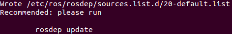
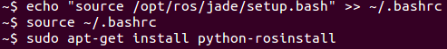

##LAB5 ROS的安装
***
####1. ROS是什么？
 * ROS就是Robot operation system，是一套底层提供硬件驱动，软件层面支持通用的文件格式的框架。我们主要用它的仿真功能。
 * 它提供一些标准操作系统服务，例如硬件抽象，底层设备控制，常用功能实现，进程间消息以及数据包管理
 * 是基于一种图状架构，从而不同节点的进程能接受，发布，聚合各种信息（例如传感，控制，状态，规划等等）
 * 目前ROS主要支持Ubuntu。它的首要设计目标是在机器人研发领域提高代码复用率。并且其是一种分布式处理框架(又名Nodes)。 这使可执行文件能被单独设计，并且  在运行时松散耦合。这些过程可以封装到数据包(Packages)和堆栈(Stacks)中，以 便于共享和分发。ROS还支持代码库的联合系统。使得协作亦能被分发。
***
####2. ROS安装过程

  1. 配置Ubuntu软件仓库，以允许“restricted”、“universe”、“multiverse”这三种安装模式。            
     这一步其实可以省略，因为我的ubuntu系统已经默认这三种模式。
  2. 建立sourse.list              
     在终端中输入命令：       
   
         sudo sh -c 'echo "deb http://packages.ros.org/ros/ubuntu $(lsb_release -sc) main" > /etc/apt/sources.list.d/ros-latest.list'
  3. 添加keys    
     在终端中输入命令：
    
         sudo apt-key adv --keyserver hkp://pool.sks-keyservers.net --recv-key 0xB01FA116
  4. 进行安装         
     先进行更新：
    
         sudo apt-get update
     我的ubuntu版本为14.04，所以要安装工具来解决依赖性问题：
    
         sudo apt-get install libgl1-mesa-dev-lts-utopic
  5. 然后安装完整版的函数库和工具：
         
         sudo apt-get install ros-jade-desktop-full
  6. 初始化rosdep，以便在需要编译某些源码的时候为其安装一些系统依赖，然后更新rosdep：
         
         sudo rosdep init
         rosdep update
     
        
  7. 进行环境配置，安装rosinstall：rosinstall 是ROS中一个独立分开的常用命令行工具：
    
         echo "source /opt/ros/jade/setup.bash" >> ~/.bashrc
         source ~/.bashrc
         sudo apt-get install python-rosinstall
     
  8. 获得所安装包的源码：
       
         apt-get source ros-jade-laser-pipeline
  9. 成功安装完毕
       

***
