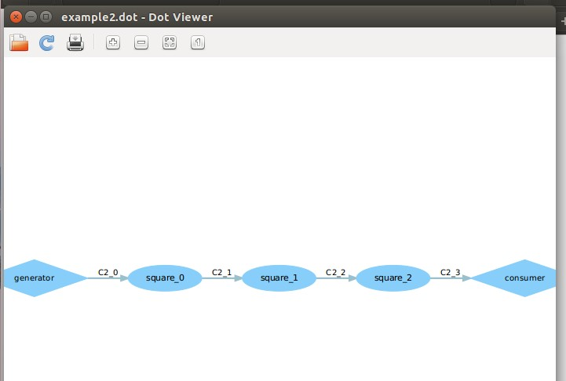

# DOL实例分析&编程

##一.实验结果
###1.修改example2,让3个square模块变成2个：
	
原example.dot：
	

 

修改后的example.dot：

###2.修改example1,使其输出3次方数：

原二次方结果：

	
 

修改后的三次方结果：

 

##二.修改过程

###1.对于example2

 修改example2.xml中的value值，将value＝“3”改为value＝“2”即可：
 
 
 
 因为在example2中，使用迭代生成的方法生成n个process，上面这句话的意思是定义一个变量，这个变量值为“3”，变量名字为N；
 
 
 
 可以看到上面这段代码，则是一个循环连接，这个循环是从i到小于N,即循环从0到小于3，那么就是循环3次，所以中间连接的square模块是有3个。如果我们将value改为“2”的话，那么其最终解析得到的N就是2，那么只会产生两个square模块。

###2.对于example1
修改example1中的square.c，修改如下：

即将下面的

修改为

即可。

因为在square.c中主要做的事情就是定义平方进程，然后通过square_fire信号处理函数,读入输入端信号i,将其平
方后得到的结果写出到输出端,也是重复len次之后停止。所以这里只需将平方进程改为三次方进程，其它地方无需修改。

 
##三.实验感想
 
1.对于每一个example，里面是由生产者进程和消费者进程构成的，生产者和消费者之间的连接则是通过square进程连接起来：

generator.c:定义生产者进程

consumer.c:定义消费者进程

square.c:定义生产者和消费者过程中需要完成的事情，比如平方进程

2.在generator.c中，先是要定义一个生产者进程，进行初始化，然后定义一个信号产生函数，进行生产者的循环过程；

3.在consumer.c中，也是先是定义一个消费者进程，进行初始化，然后定义一个信号消费函数，进行消费者的循环过程；

4.在square.c中，定义一个进程（init函数必须要有，但是里面可以不写东西），进行初始化，然后定义一个信号处理函数，进行进程的循环过程；

5.在example1.xml文件中，由三个部分组成：分别是process，channel和connection。

对于.dot中的图来说，process就是框，channel就是线，connection就是将框和线连接起来。

对于其它代码的解析，ta在文档中以及课堂上说的很清楚。这里觉得要特别注意的一点就是里面的name＝“0”和name＝“2”是分别对应.h文件中的PORT_OUT和PORT_IN的宏定义。

