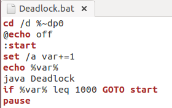
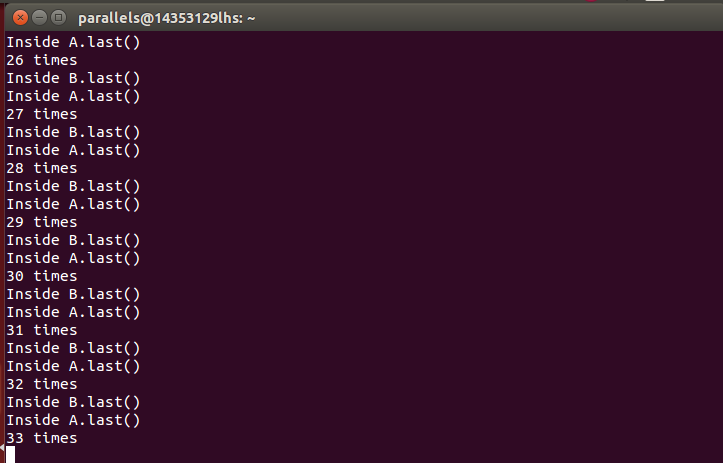

## Deadlock死锁分析

###1.出现死锁的截图

Deadlock.bat:
	

 

 第33次的时候出现死锁：

###2.产生死锁的四个必要条件

* 互斥条件：一个资源每次只能被一个进程使用

* 请求与保持条件：一个进程因请求资源而阻塞时，对已获得的资源保持不放

* 不剥夺条件:进程已获得的资源，在末使用完之前，不能强行剥夺

* 循环等待条件:若干进程之间形成一种头尾相接的循环等待资源关系

 

###3.产生死锁的解释

当调用java Deadlock的时候，因为Runnable一运行就会调用run()函数，所以会调用b.method(A)，此时线程1访问的是 B的一个synchronized同步代码块，会得到B的对象锁;

在还没有来得及执行调用a.last()函数时，这时候刚好count到20000，所以执行a.method(B)，此时线程2访问的是A的一个synchronized同步代码块，获得A的对象锁;

而如果要执行a.last()的话必须得等线程1先释放A的对象锁，要执行b.last()的话必须得等线程2先释放B的对象锁,所以这里会产生死锁；

这里产生死锁的条件就是上面说的第二个条件：

* 请求与保持条件：当一个进程因请求资源而阻塞时，对已获得的资源会保持不放。

这也是因为关键字synchronized的特性，因为使用该关键字时，会保证在同一时刻最多只有一个线程能执行该段代码，当一个线程访问object的一个synchronized同步代码块或同步方法时，其它线程对object中所有其它synchronized同步代码块或同步方法的访问将被阻塞。

所以综上，就是产生死锁的原因。

如果要解决死锁的话，那么有两种方法：

* 一种是服务生法

* 一种是给系统的资源进行分级，称为资源分级法，即分配资源的优先级

